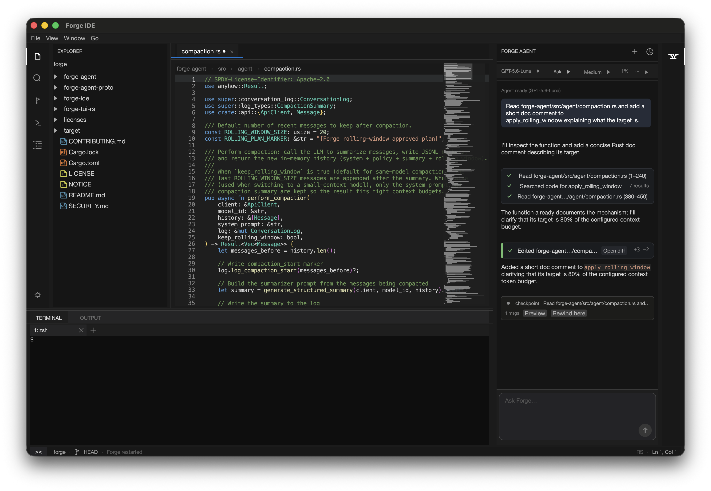
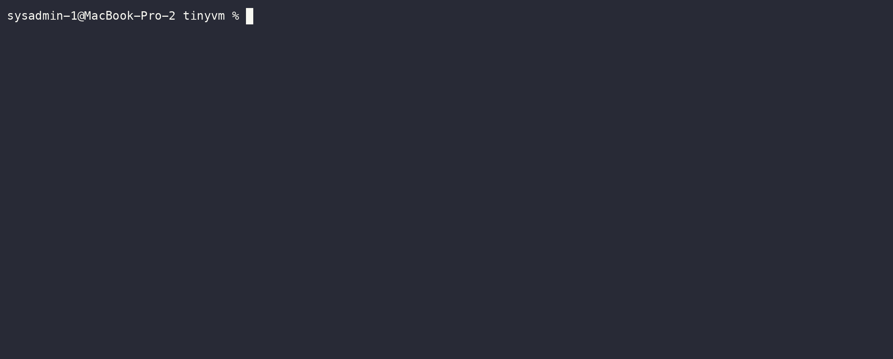

# Forge

Created by **Vulkgryph LLC**.

Forge is an autonomous AI coding agent, plus two independent clients that drive it: a terminal UI and a native code editor. This repository hosts them as one monorepo.



> _Forge IDE editing `forge-agent`, with the agent panel mid-task: tool calls folded into a checklist, an edit with its diffstat and an **Open diff** action, and a checkpoint you can rewind to._



_Forge building a `no_std` Rust VM from an empty directory: it asks what kind of VM is wanted, plans in plan mode, and — once the plan is approved with auto-accept — writes the crate, runs `cargo fmt`, `cargo test` and `cargo run`, and reports what it verified._

## Why this rather than something else

Forge exists because the alternatives make a different trade, not because they
are bad. What is different here:

**The agent is a separate program, not a feature of an editor.** `forge-agent`
runs headless and speaks a documented JSON-lines protocol
([`forge-agent-proto`](forge-agent-proto/)). The terminal client and the editor
are two independent programs that drive it, and neither embeds the other — the
[diagram below](#how-they-fit-together) is the real architecture, not a
description of modules. So the same agent is available over SSH in a terminal
and in a window with a file tree, you can script it directly, and a third
client is a protocol away rather than a fork.

**The editor is written, not forked.** `forge-ide` is a native Rust application
using egui — not a VS Code fork and not Electron. That has costs, and they are
listed honestly in [Platforms](#platforms): one supported platform, and a
smaller feature surface than an editor with a decade of extensions behind it.
What it buys is no upstream to track, and an agent panel that is part of the
editor rather than an extension in a sandbox — checkpoints, diffs and rewind
reach the buffers directly.

**Dependencies are decisions here.** The terminal client has two third-party
crates, both Unicode tables: every part of its rendering, wrapping, markdown
and diffing is in this repository. The editor decodes PNG and GIF with decoders
written for it, which replaced the `image` crate and six transitive crates. No
third-party binary ships in this repository at all — even MoltenVK, for the
optional Vulkan renderer, you install yourself.

**Permission is the design, not a setting.** Every tool call is approvable;
plan mode is read-only until you approve a plan; auto-accept is a mode the
status bar shows and you can leave; the agent gets a scratchpad of its own so
throwaway work does not land in your project; and a rewind checkpoint lets you
put a file back after the agent has edited it. The failure mode being designed
against is an agent that has already done something you would not have allowed.

**Your keys, your machine.** Any OpenAI-compatible endpoint works, nothing is
routed through a Vulkgryph service, and offline mode turns off the tools that
reach the network. The only first-party network call in the whole system is a
GitHub releases check for updates.

**It tells you what does not work.** There is a section below titled
[Web search does not really work](#web-search-does-not-really-work), about a
tool shipped in this repository. Platform support is a table of what has and
has not been run by a person, not a list of logos. That is the standard the
rest of the documentation is held to as well.

### Where it is the wrong choice

If you want an editor with a mature extension ecosystem, a team workflow with
pull requests, or Windows and Linux support for the GUI, this is not it —
contributions are closed, and only macOS is verified. The agent and the
terminal client are more portable than the editor; the table in
[Platforms](#platforms) says exactly how far each has been taken.

## The projects

| Project | What it is | Docs |
|---|---|---|
| [`forge-agent/`](forge-agent/) | The headless Rust agent — the actual model loop, tool execution, and safety gating. Everything else talks to this. | [README](forge-agent/README.md) · [Architecture](forge-agent/ARCHITECTURE.md) |
| [`forge-tui-rs/`](forge-tui-rs/) | The terminal client, installed as `forge`. Spawns `forge-agent --headless` and drives it over its JSON protocol. | [README](forge-tui-rs/README.md) |
| [`forge-ide/`](forge-ide/) | A native code editor with an integrated agent panel — spawns the same `forge-agent --headless` process independently, alongside its own editor, git, LSP, and SSH-remote features. | [README](forge-ide/README.md) |
| [`forge-agent-proto/`](forge-agent-proto/) | The wire protocol shared by the agent and the terminal client. | — |

## How they fit together

`forge-agent` is the only piece that talks to an LLM or touches tools directly. It exposes one thing: a JSON-newline protocol over stdin/stdout (`forge-agent --headless`), documented in [`forge-agent/ARCHITECTURE.md`](forge-agent/ARCHITECTURE.md). `forge-tui-rs` and `forge-ide` are two separate, independent implementations of a client against that same protocol — neither depends on the other, and neither reimplements any agent logic. This means the agent's actual behavior (tool execution, model calls, safety gating) can never diverge between the two clients, since it's the literal same compiled binary in both cases.

What *can* diverge is each client's own view of the wire protocol's shape. The terminal client shares [`forge-agent-proto`](forge-agent-proto/) with the agent, so those two cannot drift; `forge-ide` keeps its own hand-maintained Rust structs, so a protocol change has to be applied there by hand.

```text
                   ┌───────────────────────┐
                   │      forge-agent      │
                   │  (the model loop,     │
                   │  tools, safety gate)  │
                   └───────────┬───────────┘
                               │  JSON-newline protocol, stdin/stdout
               ┌───────────────┴────────────────┐
               │                                │
    ┌──────────┴──────────┐        ┌────────────┴────────────┐
    │    forge-tui-rs     │        │        forge-ide        │
    │  terminal client    │        │  native code editor     │
    │  (Rust), installed  │        │  (Rust/egui), with its  │
    │  as `forge`         │        │  own editor/git/LSP/    │
    │                     │        │  SSH-remote features    │
    └─────────────────────┘        └─────────────────────────┘
```

## Install / defaults

This monorepo is the **canonical** Forge source. The standalone `forge` and `Forge-IDE` checkouts are retired.

```bash
# from a checkout of this repo:
./forge-agent/install.sh
# or later:
forge-update
```

That installs:

| Command | Points at |
|---|---|
| `forge` | `forge-tui-rs`, built from this workspace and installed as `~/.local/share/forge/bin/forge` |
| `forge-agent` | `target/release/forge-agent` from this workspace |
| `forge-update` | `forge-agent/update.sh` in this repo |

`forge-ide` is optional and built separately (`cargo build -p forge-ide`) when you want the editor; it is not part of the default PATH install.

On macOS there is also a notarized `.dmg` on the [releases page](https://github.com/Vulkgryph/Forge/releases) if you would rather not build the editor yourself. It is signed with Vulkgryph LLC's Developer ID and notarized by Apple, so it opens without the unidentified-developer warning. The terminal client is not distributed that way — `install.sh` builds it from this checkout.

## Platforms

**macOS is the supported platform.** It is where Forge is developed and used
every day, and the only one where any of this has been verified by a person
using it. Linux and Windows compatibility is unverified — see the table for what
that means per component.

Architecture matters here as much as the operating system, and the two Linux
columns have never been the same machine: CI runs on x86-64, and the Linux box
this is actually used against is ARM64.

| | macOS (Apple Silicon) | Linux x86-64 | Linux ARM64 | Windows |
|---|---|---|---|---|
| `forge-agent` | supported | compiles and passes tests | runs headless on a remote | untested |
| `forge-server` | n/a — runs on the remote | cross-compiled, never run | runs headless on a remote | untested |
| `forge-tui-rs` (`forge`) | supported | compiles and passes tests | untested | untested |
| `forge-ide` | supported | untested | untested | untested |

One feature is narrower than its component. When a bot check refuses the
crawler, the agent can offer the page to a person, who opens it in a real
browser and hands it back — and that browser is `WKWebView`, so it exists on
macOS and nowhere else. The agent is told at startup whether its client can
open a page at all, so on every other platform it says the site refused an
automated request and answers from what else it has, rather than offering a
handoff nothing can satisfy. A Linux or Windows port of the editor would need
its own web view before that feature came with it.

**supported** — developed and used on this platform every day, which is the
evidence behind the word. CI coverage is not what it rests on, and differs by
component: `forge-ide` is built and its tests run on a macOS runner on every
push; `forge-agent` is built on macOS by the packaging job but its test suite
runs on Linux; `forge-tui-rs` is built and tested on Linux only.

**compiles and passes tests** — CI builds it on x86-64 Linux and the test suite
passes there on every push. Nobody has sat in front of it on a Linux desktop. A
build that works and a program that behaves are different claims, and only the
first one is being made.

**runs headless on a remote** — the agent and the file/pty server are uploaded to
a Linux machine and driven over SSH by remote development, exercised regularly
against an **aarch64** host (`Linux 6.11 aarch64`). That is real use, but it is
unattended: no terminal of its own, no window, no keyboard. It is also the only
ARM64 Linux evidence there is — nothing on that column has been through CI.

**cross-compiled, never run** — the x86-64 musl binary is built by the packaging
script and shipped in the app bundle, so an x86-64 remote would receive it, and
no such remote has ever been connected to.

On macOS, only Apple Silicon: the binary this repository builds is arm64, and
Intel Macs are untested. Rosetta is not a substitute for having tried it.

**untested** means literally that. The editor renders through wgpu, which targets
D3D12 on Windows and Vulkan on Linux, and takes its window from winit, so there
is no known reason it cannot work — nobody has tried. Until someone runs it, a
report that it does not build is expected rather than surprising, and worth
filing.

The macOS app bundle, its signing, and the "add to Dock" option are macOS-only by
nature. Remote development is exercised from a macOS host to a Linux remote; the
reverse has never been run.

## Model providers

Forge talks to any OpenAI-compatible endpoint, to Anthropic, and to a local
model server, in each case with an API key you supply. It also supports signing
in to a **ChatGPT Codex** subscription, which is worth understanding before you
rely on it:

- The flow is OAuth against OpenAI's own endpoints (`forge-agent
  --login-chatgpt`, or the wizard in the editor). The token it returns is
  stored at `~/.config/forge/chatgpt_auth.json`, readable only by you, and
  refreshed automatically.
- OpenAI does not publish an OAuth integration for third-party clients, so this
  drives a consumer subscription through an interface documented for OpenAI's
  own tools. It works today. It is not a sanctioned integration, and it could
  stop working, or be objected to, at any point — in which case this project
  will comply and remove it.
- The risk of an objection lands on your OpenAI account rather than on this
  project: a consumer subscription driven through an unsanctioned client can be
  flagged or suspended without notice. That is exactly why Anthropic
  subscription login was removed outright rather than kept — see
  [forge-agent's CHANGELOG](forge-agent/CHANGELOG.md).
- If that matters to you, use an API key. Every other provider path is a
  documented, sanctioned one.

xAI has OAuth of the same shape for SuperGrok and X Premium+ subscriptions, and
Forge deliberately does **not** implement it: xAI's consumer terms prohibit
programmatic access and reverse engineering, and route developer use to their
Enterprise terms with an API key. Grok works here through an API key.

## Search is ours now

`web_search` used to scrape DuckDuckGo's HTML, which challenges automated
queries and refused most of them. A tool that usually returns nothing is worse
than one that is absent: the model spends a turn on it and then reasons about
the emptiness as if it meant something. So it was off by default, with a note
saying "off until there is a real search behind it".

There is one now, in `forge-search` — a crawler, an inverted index, BM25
ranking and snippets, with no dependencies. It answers from pages Forge has
actually read. The cost is that it only knows what it has crawled, so a query
the index cannot answer crawls first, which takes up to 25 seconds once and
milliseconds afterwards. Pass `sites` to aim the crawl somewhere specific
rather than rephrasing the query.

It is **on by default** now. Anyone who ran an earlier version has
`disabled_tools = ["web_search"]` written to their config already, and that is
indistinguishable from having chosen it, so it is left alone — the tools menu
in either client turns it back on.

Crawling has limits that are not bugs. `robots.txt` is obeyed, including
`Crawl-delay`, and requests to one host are spaced a second apart by default.
Sites that refuse crawlers are refused, and PubMed Central refuses everyone:
its `robots.txt` is `User-agent: *` and `Disallow: /`.

## Literature, through the front door

Which is why there is a second tool. `search_papers` asks Europe PMC's REST
API — the channel published for programmatic access — rather than crawling a
website that has asked not to be crawled. It searches, fetches the full text of
articles whose licence permits keeping it, and indexes that; anything else
comes back as a citation and a link, and says so.

Only open-access articles have their text kept. That is more conservative than
it has to be, and deliberately so: it is one sentence to state and one
condition to audit. Every result reports the licence its text is held under,
because a passage quoted without its terms is a passage quoted blind — `cc by`
wants attribution, `cc by-nc` excludes commercial use, and the index carries
that with the document so it survives being saved and searched a month later.

This is what the crawler could not do. Asked for pyramidal neuron patch-clamp
recordings at a stated temperature, it answers out of a Methods section:

> We performed electrophysiological recordings at room temperature
> (20°C-25°C), but the recording chamber might be heated to
> near-physiological temperatures using a bath-controller

`web_fetch` is unaffected: give it a URL and it fetches that page.

## Using this safely

Forge is a sharp tool. It reads, writes, and executes code on your machine with
your user account's permissions. There is no sandbox — approval prompts are the
barrier, and auto-approval modes remove them on purpose. `forge-ide` also
uploads a helper binary to any SSH host you connect to and runs it there.

Read the [Safety Model](forge-agent/README.md#safety-model) before turning on
anything that skips approval, and the per-component disclaimers in
[forge-agent](forge-agent/README.md) and [forge-ide](forge-ide/README.md).

Forge is provided **"AS IS"**, without warranty of any kind, and you are
responsible for what you approve it to do. [LICENSE](LICENSE) is the binding
document; [SECURITY.md](SECURITY.md) is how to report a vulnerability.

## How this is built

Forge is built with the assistance of AI coding tools, and is directed,
reviewed and released by Vulkgryph LLC. See [NOTICE](NOTICE) for that and for
the third-party attributions.

## License

Everything here is licensed under the [Apache License, Version 2.0](LICENSE), copyright © 2026 Vulkgryph LLC. See each project's own `LICENSE`/`NOTICE` for its own copy, and `SECURITY.md` for how to report a vulnerability in that specific project.

## Contributing

None of the three projects currently accept pull requests — each is maintained by Vulkgryph LLC with contributions closed to keep maintenance scope constrained. Issues are welcome on each project; see the relevant README for details.
